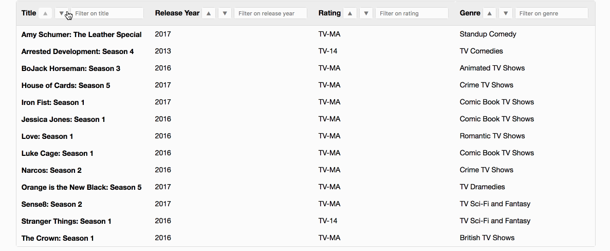

# Flixgrid

This repo contains an datagrid component. Data and column props passed in can be customized for custom-rendered content. This demo features sorting and keyword filtering.

You can view the old demo [here](flixgrid.gif).

## Getting Started

### Installation

Install dependencies using [`yarn`](https://yarnpkg.com/en/) or `npm install`.

### Running Locally

Run `yarn start` to start the app in development mode and open [`http://localhost:3000`](`http://localhost:3000`) in a browser to view.

### Build

To generate a production build in the `build/` folder, run `yarn run build`.

You can run the production build locally using `NODE_ENV=production yarn start`.

## Tech Stack

* React
* Node/Express
* Babel
* Webpack 2

## Technical Challenges

  1. **Components and Props** - Significant time was used architecting the flow of state as props from top-level components (`Flixgrid`, `Table`) to lower-level ones. Since I separated out pieces of a table (row, cell, body, head), many relevant pieces of state needed to be passed along, which may be seen as component prop bloat.
      * However, much of the logic would be obscured away from a user anyhow (since he or she would use just the top-level `Table`).

## Technical Considerations

1. **Empty Dataset** - I wanted to demonstrate the datagrid's ability to render a table even without data. I added conditions to display a "No data" cell that spans all columns.
2. **Data and Columns** - The approach I took for how data was rendered was inspired by my usage of a popular UI library called [ANTDesign](https://ant.design/docs/react/introduce). Data to be rendered is an array of objects, while a separate array of objects represents how the columns are arranged.

## Disclaimer

I used my own [react-quick-start](https://github.com/atsao/react-quick-start) boilerplate to save myself time setting up the environment. While I could've used `create-react-app`, I am familiar with the scaffold I created.

## Future Features

1. **Sorting**
    * Ability to customize sorting further (sort by column 1, then column 2, etc.)
    * Ability to toggle sorting instead of separate buttons
2. **Filtering**
    * Ability to filter using dropdown (e.g., checkboxes)
3. **UX**
    * Ability to show/hide filter input using toggle

## To Do

* More tests
* UX elements (loading spinner, UI design)
